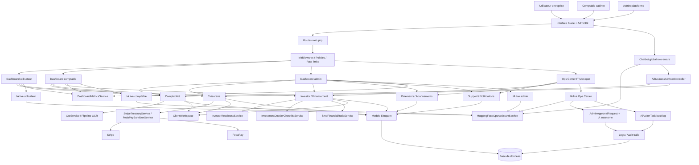

# Modèle en graphe global (plateforme + IA)

Ce graphe illustre l'ensemble de la plateforme avec les flux métier principaux et les ajouts IA transverses.

## Graphe global

## Lecture rapide

- Les trois profils (utilisateur, comptable, admin) passent tous par la même entrée HTTP Laravel.
- Les domaines coeur restent `Comptabilité`, `Trésorerie`, `Investor`, `Paiements`, `Support`.
- L'IA est désormais transverse : chatbot global + IA live par dashboard.
- L'IA autonome est bornée par un mécanisme de gouvernance (`AdminApprovalRequest`) et tracée dans les logs/audits.
