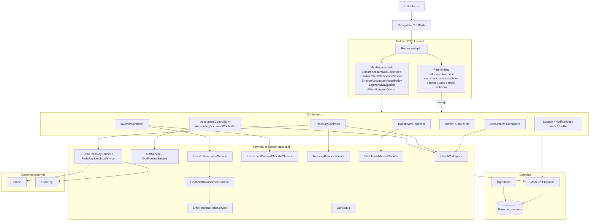
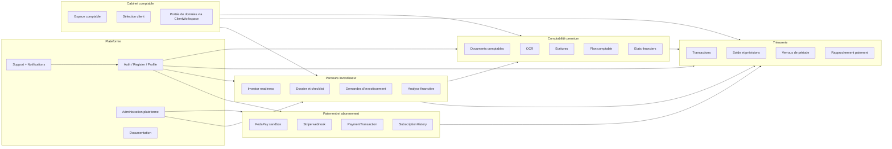
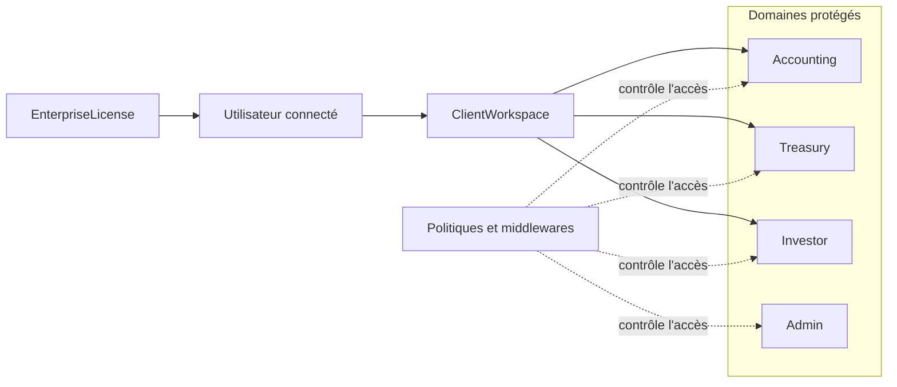
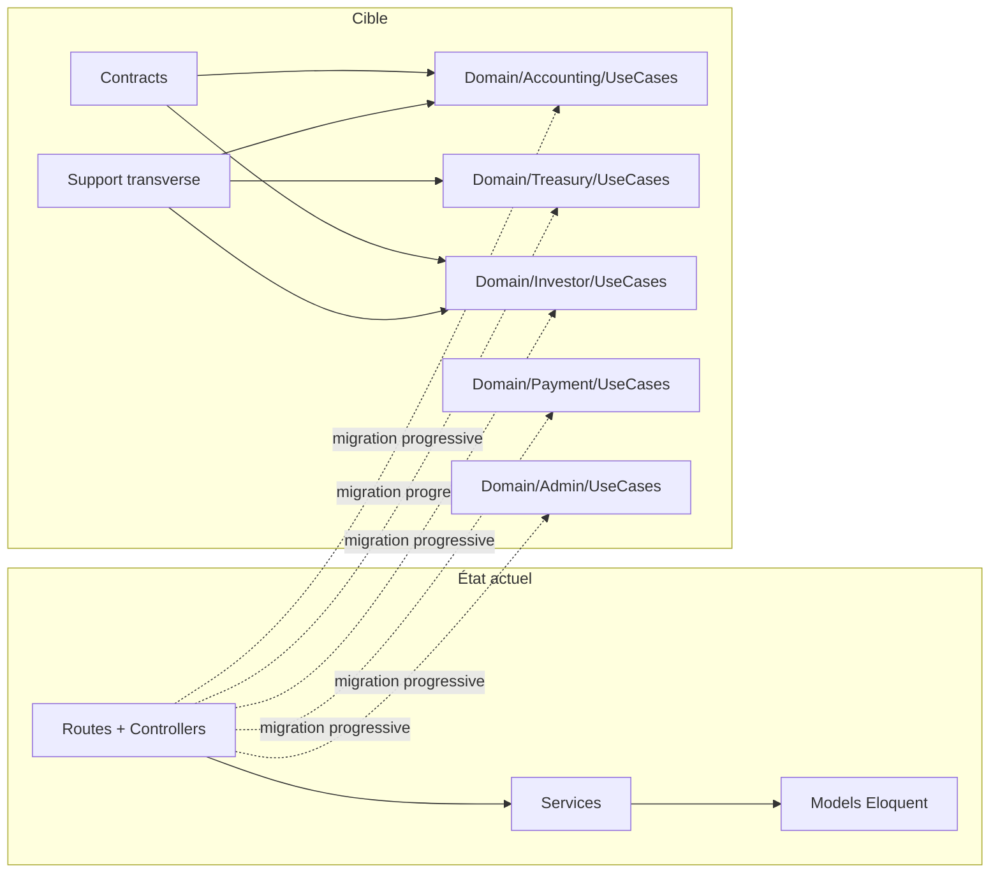

# Architecture plateforme (Mermaid)

Ce document représente l'architecture applicative telle qu'elle existe aujourd'hui dans le code, avec la cible modulaire préparée dans `app/Domain`.

Diagrammes séparés :
- `docs/architecture/01-vue-ensemble-mermaid.md`
- `docs/architecture/02-flux-critique-mermaid.md`
- `docs/architecture/03-contrats-integrite-mermaid.md`
- `docs/architecture/04-modele-graphe-global-ia.md`
- Pack UML (composants/classes/séquences/états) : `docs/uml/README.md`

## Vue en couches

## Vue par domaines métier

## Flux transverse de portée et gouvernance

## Cible modulaire progressive

## Lecture rapide

- L'application reste un monolithe Laravel structuré autour de `routes/web.php`, des middlewares `web`, des contrôleurs HTTP, des services applicatifs et des modèles Eloquent.
- La séparation métier la plus visible concerne `Accounting`, `Treasury`, `Investor`, `Payment`, `Admin` et le portail `Accountant`.
- `ClientWorkspace` est un mécanisme transverse important pour la portée des données multi-clients.
- `FinancialRatioServiceContract` et `app/Domain/*` montrent une transition vers une architecture plus modulaire, mais la majorité du code d'exécution reste encore dans `Http`, `Services` et `Models`.

