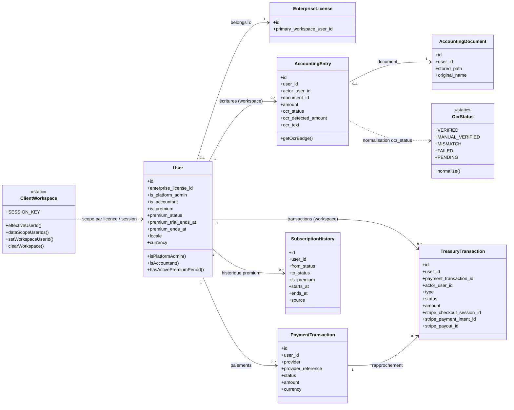

# UML — Diagramme de classes (entités clés)

```mermaid
classDiagram
direction LR

class User {
  +id
  +enterprise_license_id
  +is_platform_admin
  +is_accountant
  +is_premium
  +premium_status
  +premium_trial_ends_at
  +premium_ends_at
  +locale
  +currency
  +isPlatformAdmin()
  +isAccountant()
  +hasActivePremiumPeriod()
}

class EnterpriseLicense {
  +id
  +primary_workspace_user_id
}

class ClientWorkspace {
  <<static>>
  +SESSION_KEY
  +effectiveUserId()
  +dataScopeUserIds()
  +setWorkspaceUserId()
  +clearWorkspace()
}

class AccountingEntry {
  +id
  +user_id
  +actor_user_id
  +document_id
  +amount
  +ocr_status
  +ocr_detected_amount
  +ocr_text
  +getOcrBadge()
}

class AccountingDocument {
  +id
  +user_id
  +stored_path
  +original_name
}

class OcrStatus {
  <<static>>
  +VERIFIED
  +MANUAL_VERIFIED
  +MISMATCH
  +FAILED
  +PENDING
  +normalize()
}

class TreasuryTransaction {
  +id
  +user_id
  +payment_transaction_id
  +actor_user_id
  +type
  +status
  +amount
  +stripe_checkout_session_id
  +stripe_payment_intent_id
  +stripe_payout_id
}

class PaymentTransaction {
  +id
  +user_id
  +provider
  +provider_reference
  +status
  +amount
  +currency
}

class SubscriptionHistory {
  +id
  +user_id
  +from_status
  +to_status
  +is_premium
  +starts_at
  +ends_at
  +source
}

User "0..1" --> "1" EnterpriseLicense : belongsTo
ClientWorkspace ..> User : scope par licence / session

User "1" --> "0..*" AccountingEntry : écritures (workspace)
AccountingEntry "0..1" --> "1" AccountingDocument : document
AccountingEntry ..> OcrStatus : normalisation ocr_status

User "1" --> "0..*" TreasuryTransaction : transactions (workspace)
User "1" --> "0..*" PaymentTransaction : paiements
PaymentTransaction "1" --> "0..*" TreasuryTransaction : rapprochement

User "1" --> "0..*" SubscriptionHistory : historique premium
```

