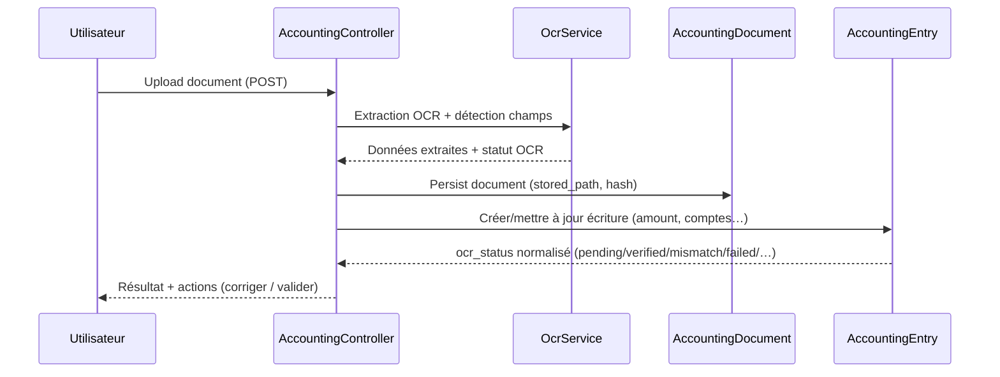
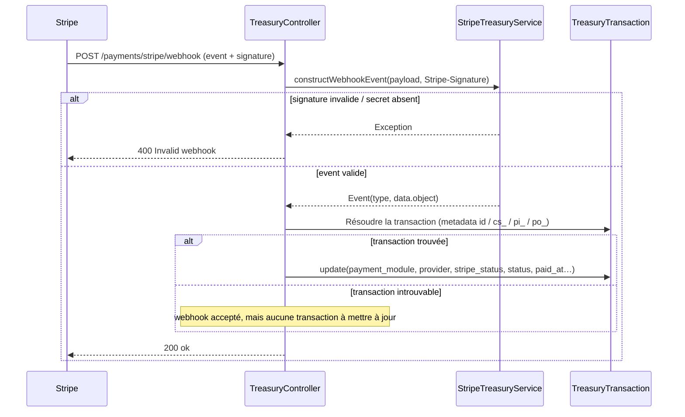
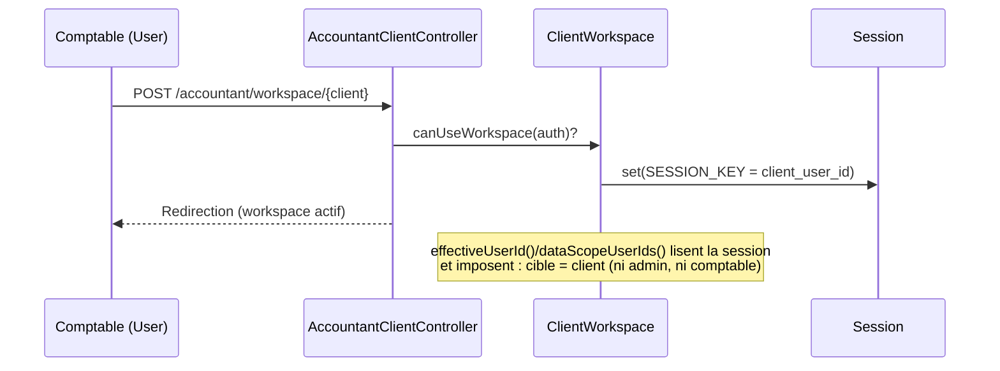

# UML — Diagrammes de séquence (flux critiques)

## 1) OCR → Comptabilité

```mermaid
sequenceDiagram
    participant U as Utilisateur
    participant AC as AccountingController
    participant O as OcrService
    participant AD as AccountingDocument
    participant AE as AccountingEntry

    U->>AC: Upload document (POST)
    AC->>O: Extraction OCR + détection champs
    O-->>AC: Données extraites + statut OCR
    AC->>AD: Persist document (stored_path, hash)
    AC->>AE: Créer/mettre à jour écriture (amount, comptes…)
    AE-->>AC: ocr_status normalisé (pending/verified/mismatch/failed/…)
    AC-->>U: Résultat + actions (corriger / valider)
```

## 2) Webhook Stripe → Trésorerie

```mermaid
sequenceDiagram
    participant Stripe as Stripe
    participant TC as TreasuryController
    participant STS as StripeTreasuryService
    participant TT as TreasuryTransaction

    Stripe->>TC: POST /payments/stripe/webhook (event + signature)
    TC->>STS: constructWebhookEvent(payload, Stripe-Signature)
    alt signature invalide / secret absent
        STS-->>TC: Exception
        TC-->>Stripe: 400 Invalid webhook
    else event valide
        STS-->>TC: Event(type, data.object)
        TC->>TT: Résoudre la transaction (metadata id / cs_ / pi_ / po_)
        alt transaction trouvée
            TC->>TT: update(payment_module, provider, stripe_status, status, paid_at…)
        else transaction introuvable
            note over TC: webhook accepté, mais aucune transaction à mettre à jour
        end
        TC-->>Stripe: 200 ok
    end
```

## 3) Sélection “dossier client” (cabinet comptable)

```mermaid
sequenceDiagram
    participant A as Comptable (User)
    participant ACC as AccountantClientController
    participant CW as ClientWorkspace
    participant S as Session

    A->>ACC: POST /accountant/workspace/{client}
    ACC->>CW: canUseWorkspace(auth)?
    CW->>S: set(SESSION_KEY = client_user_id)
    ACC-->>A: Redirection (workspace actif)

    note over CW: effectiveUserId()/dataScopeUserIds() lisent la session<br/>et imposent : cible = client (ni admin, ni comptable)
```

