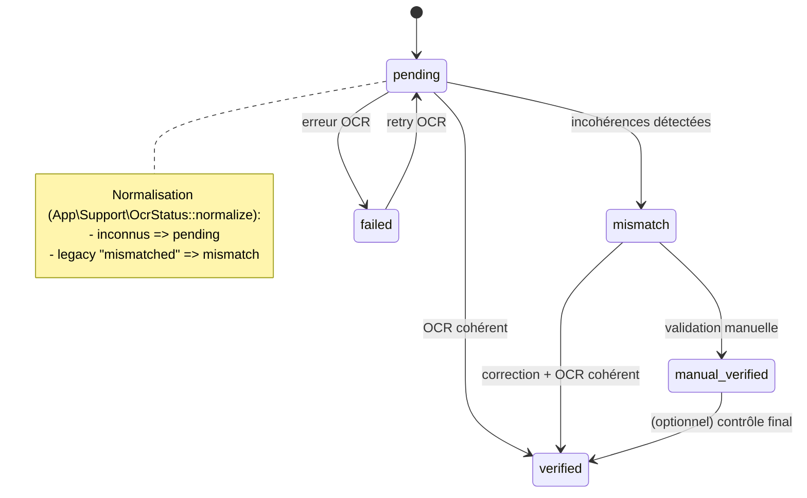
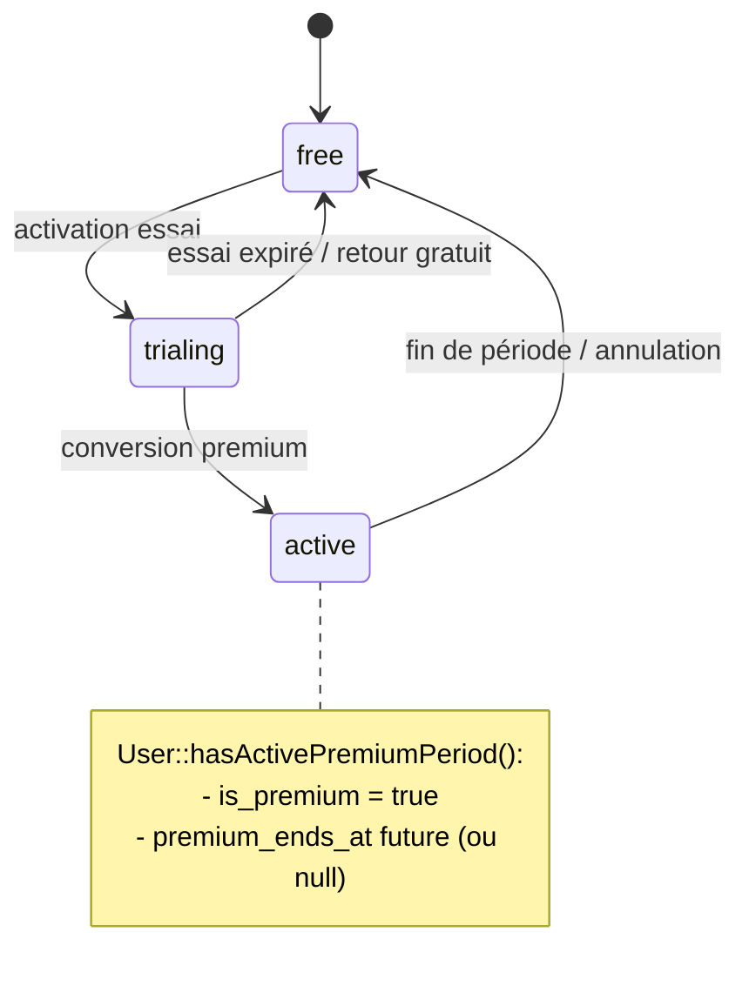

# UML — Diagrammes d’états (statuts métier)

## 1) Statut OCR d’une écriture (`AccountingEntry.ocr_status`)

```mermaid
stateDiagram-v2
    [*] --> pending

    pending --> verified: OCR cohérent
    pending --> mismatch: incohérences détectées
    pending --> failed: erreur OCR

    mismatch --> manual_verified: validation manuelle
    mismatch --> verified: correction + OCR cohérent
    failed --> pending: retry OCR

    manual_verified --> verified: (optionnel) contrôle final

    note right of pending
      Normalisation (App\\Support\\OcrStatus::normalize):
      - inconnus => pending
      - legacy "mismatched" => mismatch
    end note
```

## 2) Cycle Premium (lecture applicative)

```mermaid
stateDiagram-v2
    [*] --> free
    free --> trialing: activation essai
    trialing --> active: conversion premium
    trialing --> free: essai expiré / retour gratuit
    active --> free: fin de période / annulation

    note right of active
      User::hasActivePremiumPeriod():
      - is_premium = true
      - premium_ends_at future (ou null)
    end note
```

