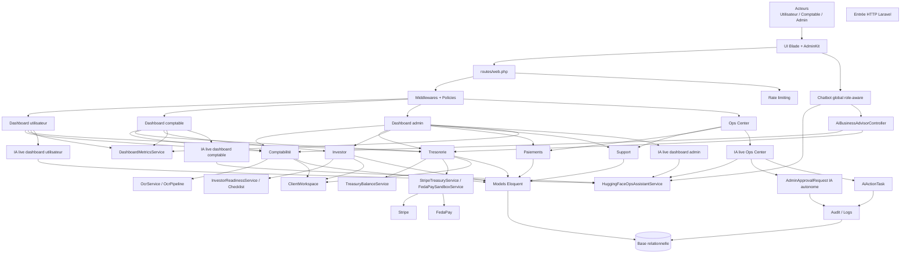

# UML — Composants globaux avec IA

Ce diagramme UML de composants reprend la vue globale de la plateforme en intégrant explicitement la couche IA (chatbot, IA live, approbations).

```mermaid
flowchart TD
    actorU[Acteurs<br/>Utilisateur / Comptable / Admin]
    ui[UI Blade + AdminKit]

    packageHttp[Entrée HTTP Laravel]
    routes[routes/web.php]
    mw[Middlewares + Policies]
    rl[Rate limiting]

    dUser[Dashboard utilisateur]
    dAcc[Dashboard comptable]
    dAdmin[Dashboard admin]
    ops[Ops Center]

    cAcc[Comptabilité]
    cTre[Tresorerie]
    cInv[Investor]
    cPay[Paiements]
    cSup[Support]

    s1[DashboardMetricsService]
    s2[OcrService / OcrPipeline]
    s3[TreasuryBalanceService]
    s4[StripeTreasuryService / FedaPaySandboxService]
    s5[InvestorReadinessService / Checklist]
    s6[ClientWorkspace]

    aiHub[HuggingFaceOpsAssistantService]
    aiChat[Chatbot global role-aware]
    aiUser[IA live dashboard utilisateur]
    aiAcc[IA live dashboard comptable]
    aiAdmin[IA live dashboard admin]
    aiOps[IA live Ops Center]
    aiAdv[AiBusinessAdvisorController]
    aiAppr[AdminApprovalRequest IA autonome]
    aiTask[AiActionTask]

    model[Models Eloquent]
    db[(Base relationnelle)]
    audit[Audit / Logs]
    stripe[Stripe]
    fedapay[FedaPay]

    actorU --> ui
    ui --> routes
    routes --> mw
    routes --> rl
    mw --> dUser
    mw --> dAcc
    mw --> dAdmin
    mw --> ops

    dUser --> cAcc
    dUser --> cTre
    dAcc --> cAcc
    dAcc --> cTre
    dAcc --> cInv
    dAdmin --> cAcc
    dAdmin --> cTre
    dAdmin --> cInv
    dAdmin --> cPay
    dAdmin --> cSup
    ops --> cSup
    ops --> cPay

    dUser --> s1
    dAcc --> s1
    dAdmin --> s1
    cAcc --> s2
    cTre --> s3
    cTre --> s4
    cInv --> s5
    cAcc --> s6
    cTre --> s6
    cInv --> s6

    ui --> aiChat --> aiHub
    dUser --> aiUser --> aiHub
    dAcc --> aiAcc --> aiHub
    dAdmin --> aiAdmin --> aiHub
    ops --> aiOps --> aiHub
    aiChat --> aiAdv
    aiAdv --> cAcc
    aiAdv --> cTre
    aiOps --> aiAppr
    aiOps --> aiTask

    cAcc --> model
    cTre --> model
    cInv --> model
    cPay --> model
    cSup --> model
    model --> db
    aiAppr --> audit --> db
    aiTask --> audit

    s4 --> stripe
    s4 --> fedapay
```
